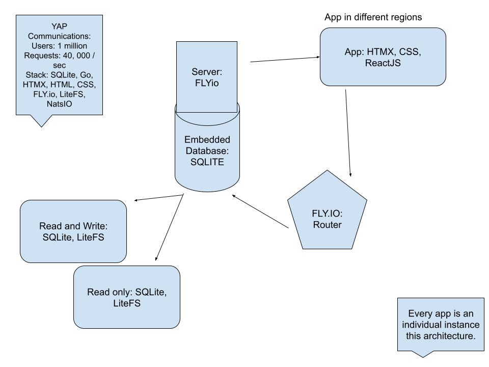

# Yap Communications 🐨

## Table of Contents

<!-- - [Project link](#project-link) -->
<!-- - [Usage](#usage) -->
- [Description](#description)
- [Contributors](#contributors)
- [Contact](#contact)

<!-- ## Project Link -->

### Project Repository

<https://github.com/adoublef/yap>

## Application License

 

## Description

1. **Yaps and Anonymity**:
   Users can create posts, referred to as "Yaps," which adds an element of anonymity to the platform. Anonymity can encourage open and honest communication while protecting users' privacy.

2. **Global Message Board**:
   The platform serves as a global message board, providing a space for users to share their Yaps with the entire user base. This can lead to a diverse range of content and discussions from people around the world.

3. **Voting System**:
   Users have the ability to vote on Yaps, which adds an interactive and engaging element to the platform. Voting can help to highlight popular and insightful content, making it more visible to the community.

4. **Region-Based Notifications**:
   To enhance the user experience and relevance, the platform offers region-based notifications. Users can subscribe to notifications for new posts in their specific geographical region. This feature keeps users informed about content that's most pertinent to them.

5. **Distributed Architecture**:
   The web application is built on a distributed architecture, which provides scalability, fault tolerance, and efficient data management. This architecture ensures that the platform can handle a large number of users and Yaps without compromising performance.

6. **Fly.io Deployment**:
   The application is deployed on Fly.io, a platform that simplifies the deployment and scaling of containerized applications. This choice allows for easy management and scaling as the user base and content volume grow.

7. **LiteFS Data Replication**:
   The system utilizes LiteFS, which replicates data from the primary node's embedded SQLite file to replica read-only nodes. This approach ensures data consistency, durability, and availability, even in the face of potential hardware or software failures. Users can expect a reliable service with their Yaps and votes preserved.

8. **Embedded NATS Server**:
   The application incorporates an embedded NATS (NATS.io) server. NATS is a lightweight and high-performance messaging system that is well-suited for real-time communication. In this context, it's used to handle messaging with Server-Sent Events (SSE) to clients. This enables the platform to push updates and notifications to users in real-time, making the user experience more dynamic and engaging.

In summary, this web application provides a versatile and secure environment for users to share their thoughts and engage with others globally or in their local region. The use of a distributed architecture, data replication with LiteFS, and the embedded NATS server ensures that the platform is highly available and responsive, making it a reliable and enjoyable experience for users.

## Tech Stack & Dependencies

- Golang
- Go-Chi Router
- Go Templating
- SQLite
- LiteFS
- NATS.io
- Fly.io

## Contributors

### Kristopher Rahim

 <https://github.com/adoublef>

## Contact

I'm open to connect with all, whether it's to pair programme, work opportunities, or a general chit-chat. You can get in touch via my [email](mailto:kristopherab@gmail.com) or [LinkedIn](https://www.linkedin.com/in/kraffulbrown/)
